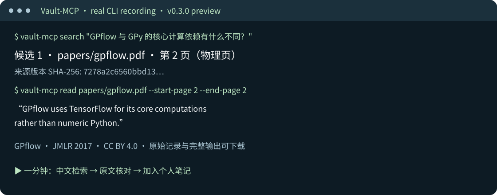

# Vault-MCP

**Ask in Chinese, find evidence in English and Chinese papers, notes and code, and verify the original source.** Local research retrieval through MCP and the CLI.

[](https://github.com/yao982/vault-mcp/actions/workflows/ci.yml)  

English · [简体中文](README.md) · [One-minute recorded demo](docs/DEMO.md) · [Measurements and failures](docs/BENCHMARK_RESULTS.md) · [Join the preview](docs/TRYOUT.md)

[](docs/DEMO.md)

**Current version: v0.3.0-preview.1.** We are seeking five independent research users. The stable release is gated on retrieval quality, correct citations, platform installation checks and real user trials. Stars are feedback; useful, verifiable evidence is the product goal.

## Try it

Use Node.js 22.13+ or 24 LTS. Normal use requires no Python, Docker or GPU. Install the preview tarball directly from GitHub Releases:

```sh
npm install -g https://github.com/yao982/vault-mcp/releases/download/v0.3.0-preview.1/vault-mcp-0.3.0-preview.1.tgz
vault-mcp index --path ./my-research
vault-mcp search "GPflow 与 GPy 的核心计算依赖有什么不同？" --path ./my-research
```

The first run downloads the local embedding model; download time is separate from indexing. To check installation without a model, use `index --no-embeddings` and `search --mode bm25`. Cross-language retrieval needs multilingual embeddings.

A runnable sample contains the real, licensed GPflow paper, a Chinese reading note and teaching code:

```sh
git clone https://github.com/yao982/vault-mcp.git
cd vault-mcp
npm ci
npm run build
node dist/index.js index --path ./sample_vault
node dist/index.js search "GPflow 与 GPy 的核心计算依赖有什么不同？" --path ./sample_vault
node dist/index.js read papers/gpflow.pdf --start-page 2 --end-page 2 --path ./sample_vault
```

Physical PDF page 2 explains how GPflow uses TensorFlow for its core computations while GPy uses numeric Python. Compare it with the [publisher PDF](https://jmlr.org/papers/volume18/16-537/16-537.pdf); [license and attribution](sample_vault/ATTRIBUTION.md). Search results include the source SHA-256, a citation ID and physical page range. Notes and code retain line ranges. Ranking scores are not probabilities that an answer is correct.

## Workflow

- Search English papers with a Chinese question, then check the physical PDF page.
- Retrieve paper evidence alongside personal notes and experiment code.
- Use the same retrieval/read implementation from an MCP client or CLI JSON output.

Text PDFs are extracted locally. Scans require an external OCR step followed by [explicit Markdown/page-map import](docs/IMPORTS.md). Without a reliable map, the result says the page is unknown. Same-name personal notes are not automatically deduplicated.

## Commands and MCP

| Command | Purpose |
|---|---|
| `serve --path <vault>` | Start stdio MCP; omitted command keeps the legacy startup behavior |
| `index --path <vault>` | Incrementally extract and index sources |
| `search "question" --path <vault>` | `--mode bm25\|vector\|hybrid`, `--limit 5` |
| `read <relative-file> --path <vault>` | Text: `--start-line`/`--end-line`; PDF: `--start-page`/`--end-page` |
| `status --path <vault>` | Read-only index, extraction and model status |
| `doctor --path <vault>` | Environment, permissions, cache, index and writer-lock checks with repair guidance |
| `import --pdf … --markdown … --path <vault>` | Explicit converted-text mapping; optional `--page-map pages.json` |

All commands except `serve` support `--json`. MCP keeps `ping_vault`, `get_vault_stats`, `search_vault` and `read_vault_file`, with structured content and additive PDF parameters. Page and line ranges cannot be mixed. [Client configuration and restart](docs/CLIENTS.md).

## Models and offline operation

New vaults use **multilingual-e5-small**: 384 dimensions, mean pooling, `query: ` / `passage: ` prefixes and normalization. Existing vaults retain BGE-small-zh: 512 dimensions and CLS pooling. Long inputs are split by actual tokenizer length, including prefixes and special tokens, then aggregated using body-token weights and normalized.

```sh
vault-mcp index --path ./my-vault --profile multilingual-e5-small
vault-mcp search "your question" --path ./my-vault --offline
vault-mcp doctor --path ./my-vault
```

Changing profiles invalidates and rebuilds vectors; incompatible representations are never mixed. The default cache is `.cache/vault-mcp/transformers` under the user home. Set `VAULT_MODEL_CACHE` to another writable location. Legacy transformers caches remain readable. `VAULT_OFFLINE=1` / `--offline` prevents model downloads; `VAULT_EMBEDDINGS=off` / `--no-embeddings` selects keyword-only operation.

Failed model downloads/loads leave keyword search available and are reported in status. Offline mode cannot provide semantic retrieval without a prepared cache.

## Consistency and limitations

One writer may use a vault at a time; the lock is acquired before database migration. Read-only commands can run alongside it. `doctor --recover-lock` only recovers a same-host lock after confirming its process is absent; lock age is not sufficient. Stop old servers before [upgrading](docs/UPGRADING.md).

PDF processing tracks pending, extracting, ready, empty and failed states. Physical pages start at 1, including blank pages. Failed updates retain the last valid result with a stale marker. File hashes and parser versions control cache reuse. Source documents remain unchanged; the derived database is `.vault_index.db` inside the vault.

Retrieval combines SQLite FTS5, local vectors and RRF. Chinese lexical terms use character unigrams/bigrams. Vector search currently scans stored vectors. Tables, columns, equations and scans have extraction limits. Unanswerable questions may still return candidates; warning text is not calibrated abstention.

No default telemetry or document upload. An MCP client may send returned passages to its configured cloud model.

## Evaluation and contribution

The [public benchmark](benchmarks/README.md) contains 10 licensed real papers and 50 frozen Chinese questions, with paper-disjoint development and held-out splits. Keyword, vector, hybrid and QMD comparisons use the same extraction. Citation validation is separate from retrieval scoring. See [actual results, hardware, scope and failures](docs/BENCHMARK_RESULTS.md).

```sh
npm test
npm run test:package
npm run models:prepare
npm run test:integration
npm run benchmark
npm run benchmark:bge
```

CI targets Windows, Linux and macOS on Node 22/24 for regression/build/package installation; real-model integration runs separately. Actual Actions results are the evidence. Join the [public trial](docs/TRYOUT.md) or start with the [contribution guide](CONTRIBUTING.md).

A lightweight UI is deferred until at least three trial users independently report CLI-resistant import-status or source-preview problems. OCR, reranking and shared services require evidence from parsing failures, retrieval misses and multi-client needs.

Code: [MIT](LICENSE). Papers retain their [CC BY 4.0 attribution](benchmarks/corpus/ATTRIBUTION.md). The [changelog](CHANGELOG.md) preserves v0.1 and v0.2 history.
